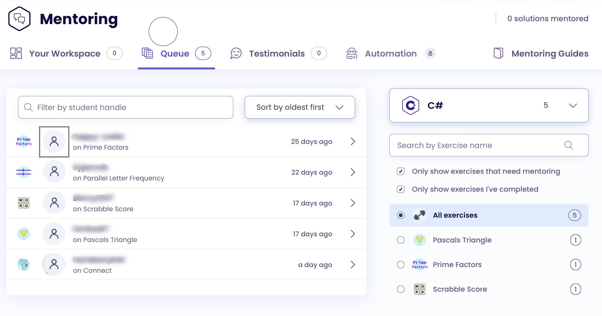

# Choosing a solution to mentor

[video:vimeo/595885125]()

The first decision you need to make as a mentor is which solution to mentor.

## Working with the Queue

You can find a list of all solutions that have been submitted for mentoring in the [Mentoring Queue](/mentoring/queue).
The UI should look something like this:

If you have a particular student you'd like to mentor, you can search using the filter box, and you can order by oldest or most recent.
On the right-hand side you can filter by language or exercise.
You can also choose to only show exercises you've completed yourself (enabled by default), which is often wise as you might struggle to give great feedback if you've not wrestled with solving the exercise yourself.

The main table shows the exercise, the student and when they requested mentoring.
Hovering on a row gives you lots more detail.
You can see more about the user: their name, location, and reputation (which is an indicator of whether they are a contributor or mentor themselves) as well as how many times they've been mentored before.
You'll also see some blurb they've written explaining what they're looking to get out of the track.
As you start mentoring people, you'll also see whether you've mentored them before, and if you've favorited them.

The blurb on the tooltip is a first indicator about whether this student is right for you.
Do their knowledge gaps match your expertise?
If they say they're looking to get good at functional programming, can you help with that?
If they're new to the language and looking to learn the basics, then if you have **any** real experience, you'll probably be able to help, but if they've been programming in that language for years and trying to hit expert-level, you'll need to have a pretty solid grasp of the language yourself.

Once you've found a solution that looks like it might be a good fit for you to mentor, we can take the next step and have a look at the code.
So click on that solution and enter the Mentoring Discussion UI!

## The Mentoring Discussion UI

At this stage you're looking at someone's solution, but haven't yet committed to mentoring it.
You first have the opportunity to read their code and get some other information, before starting.

**If you're new to this UI, it might feel a little overwhelming as there is a lot of information, but don't worry - it'll soon become familiar.**

### The student's code

On the left hand side of the screen you will see the student's code.
The UI will look something like this:

[TODO: Image of mentor discussion with areas marked].

1. The main part of the left side contains the student's code.
   By default you'll be seeing their most recent iteration.
   If they've submitted multiple iterations, you can switch through these using the numbers in circles at the bottom.
   If they've only submitted one iteration, you won't see those icons.

2. You can use the tabs at the top to switch between the student's code, the tests, and the instructions.
   This is useful for reminding yourself about what the student has been asked to do in this exercise.

3. You'll also see an indicator as to whether the tests have passed or failed.
   If they failed, clicking on this indicator will open a modal that shows you the specific details of their test run, so you can see what they did wrong.

On the right hand side, you'll see three tabs.
The overview tab will contain the same information about the user that you saw on the tooltip.
Below that you'll see a comment for the user about what it is that they want to learn from this specific solution.
(For some older solutions, this might be missing).
This is a key indicator as to whether this solution is right for you.
Can you answer their question?
Can you fulfill their hopes for this exercise?

The third tab is called "Guidance".
If you click on this you'll see some information that might be useful for you:

- **Mentor notes:** These are community-written notes that help point other mentors towards the best way to mentor an exercise.
  We'd really love you to contribute your experience back to these notes.
- **Automated feedback:** This is feedback that our analyzers have determined might be useful for you to give to a student.
  We'll discuss this more later.
- **Your solution:** A link back to your own solution, which you can use as a reference for how you solved the exercise.

## Start mentoring

If you've read the code, checked the guidance, and feel you can be helpful, then it's time to get going!
Click the "Start mentoring" button and you'll be prompted to write your feedback.

Have a read of [How to give great feedback](/docs/community/how-to-give-great-feedback) next!
